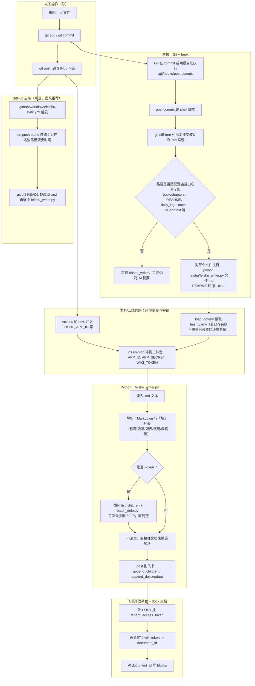

# Feishu × GitHub × 本地 Git：项目底层原理与全流程说明

> 本文面向 **Python 基础较弱** 的读者，从「你敲一条命令到飞书出现文字」的整条链路，按顺序拆开说明；并记录踩坑与解决方式，便于写周报/交接。

---

## 目录

1. [一句话说清这个项目在干什么](#1-一句话说清这个项目在干什么)
2. [总览流程图（建议先看图）](#2-总览流程图建议先看图)
3. [三条通路：你实际会用到哪条](#3-三条通路你实际会用到哪条)
4. [「底层」一：飞书端凭什么让程序写文档](#4-底层一飞书端凭什么让程序写文档)
5. [「底层」二：`feishu_writer.py` 在程序里分几步做事](#5-底层二feishu_writerpy-在程序里分几步做事)
6. [Python 小词典（读脚本时够用的概念）](#6-python-小词词典读脚本时够用的概念)
7. [「底层」三：本地 `post-commit` 钩子怎么不用你手动就执行脚本](#7-底层三本地-post-commit-钩子怎么不用你手动就执行脚本)
8. [「底层」四：GitHub Actions 的 `yml` 在干什么](#8-底层四github-actions-的-yml-在干什么)
9. [两类写入策略：`--clear` 与「追加」](#9-两类写入策略--clear-与追加)
10. [我们遇到过的问题、根因、解决办法与最终选择](#10-我们遇到过的问题根因解决办法与最终选择)
11. [新人上手：最小可运行检查清单](#11-新人上手最小可运行检查清单)
12. [与主 README 的关系](#12-与主-readme-的关系)

---

## 1. 一句话说清这个项目在干什么

- **你维护的是普通 Markdown 文件**（`README.md`、`book/chapters/*.md`、`daily_log/*.md` 等）。
- **同步到飞书** 的方式是：用 **Python 脚本** 调用飞书 **Open API**，把 `.md` 解析成飞书 `docx` 能接受的 **「块（block）」JSON**，再 **HTTP 请求** 发给飞书服务器。
- **自动化触发** 有两层：
  - 本地：你 `git commit` 后，**Git 自动运行** 一个叫 `post-commit` 的 **壳脚本（shell）**，里面执行 `python feishu_writer.py ...`。
  - 远端：你 `git push` 到 GitHub 后，**GitHub Actions** 在云端 Linux 上再跑一遍同一条 Python 命令（凭 **Secrets** 读密钥）。

---

## 2. 总览流程图（建议先看图）

下面这张图画的是「从改 md 到飞书可见」的完整路径；方框里是 **谁** 在做，箭头是 **数据/控制流**。



**读图提示：**

- **Git 不「懂」飞书**，它只是**在适当时机帮你执行**一段我们自己写的 sh 脚本；真正和飞书说话的是 **Python + requests**。
- **WIKI_TOKEN** 不是内容，是「飞书里某一页」的地址钥匙；脚本第一步会把它 **换成** 内部的 `document_id` 再写块。

---

## 3. 三条通路：你实际会用到哪条

| 通路 | 触发方式 | 典型用途 | 密钥放哪 |
| --- | --- | --- | --- |
| **A. 只运行脚本** | 你手动：`python feishu/feishu_writer.py xxx.md` | 快速把某个 md 推到当前 `.env` 指向的飞书页 | 本机 `feishu/.env`（不入库） |
| **B. 本地自动（hook）** | 每次 `git commit` 成功 | 你改 md，提交后立刻推飞书 | 同本机 `.env`；注意 PowerShell 里临时 `$env:FEISHU_WIKI_TOKEN` |
| **C. 云端自动（Actions）** | `git push` 到 `main` 且路径命中 | 团队共享、换电脑也能同步 | **GitHub Repository Secrets** |

---

## 4. 「底层」一：飞书端凭什么让程序写文档

1. **企业自建应用**：在飞书开放平台创建应用，得到 `App ID` / `App Secret`。
2. **鉴权换票**：用这两个换短期 **`tenant_access_token`**（约 2 小时有效，脚本里会缓存，快过期再换）。
3. **权限 + 发版**：在开放平台给应用勾 `docx:document`、wiki 相关等权限，**发版**后生效。
4. **文档级授权**：目标 Wiki/文档要 **把应用加为可编辑协作者**（和分享给人一样，但选的是带「应用」标签的账号），否则 API 会 `forBidden`。
5. **两种 ID**：
   - 浏览器地址栏里看到的 Wiki 页通常带 **`wiki token`**（短字符串，用来指「哪一页」）。
   - 写 docx 内容时 API 要用 **`document_id`（`obj_token`）**；所以脚本里先 **GET 一次** 做转换。

**和网络的关系：** 你的电脑（或 GitHub 服务器）通过 **HTTPS** 发 JSON 给 `open.feishu.cn`；这和你用浏览器看飞书是同一类「客户端–服务器」模型，只是客户端换成了 Python 的 `requests` 库。

---

## 5. 「底层」二：`feishu_writer.py` 在程序里分几步做事

下面用「**顺序**」描述 `main()` 里实际发生的事（和源码一致），方便你对着文件一行行看。

### 5.1 读配置

1. `load_dotenv()`：从当前工作目录上溯加载 `feishu/.env` 里的 `KEY=VALUE`。
2. 用 `os.environ.get("FEISHU_APP_ID")` 等取字符串。
3. **重要：** `python-dotenv` 的 **默认行为是：若某环境变量已经存在，则不会用 .env 覆盖它**。这解释了为什么 PowerShell 里先 `set` 了 `FEISHU_WIKI_TOKEN` 会一直「盖住」`.env`。

### 5.2 读文件与解析

1. 打开你传入的 `.md` 路径，读成一大段字符串 `md`。
2. `markdown_to_blocks(md)`：把整篇 md 变成若干「**单元**」`units`（内部结构：简单块、或表格等需要 `descendant` 接口的块）。
3. 简单块会转成 `block_type` 不同的 dict（如标题、段落、列表、代码、引用等），符合 [飞书 docx v1 块模型](https://open.feishu.cn/document) 的字段约定。

### 5.3 登录飞书

1. `FeishuClient._tenant_token()`：POST 换 token，并记录过期时间，避免每次都请求。

### 5.4 Wiki 节点 → 文档 ID

1. `wiki_node_to_doc_id(wiki_token)`：GET 返回的 JSON 里取出 `obj_token` 当 `document_id`。
2. 若该节点不是 `docx` 类型，脚本会报错（旧版 `doc` 已不推荐）。

### 5.5 可选：清空（`--clear`）

1. 先 `list_children` 取「根块」下的一级子块列表。
2. 调用 `batch_delete` 删 `[0, n)` 区间；**飞书对单次可删数量有限制**，因此实现为：**每次删不超过 50 个，循环到 `children` 为空**。
3. 中间 `sleep(0.3)` 略降请求频率，减少 **QPS 限制** 触发概率。

### 5.6 写入

1. 对于普通块：先聚在列表 `buf` 里，凑一批再 `append_children`；内部又按 50 个一批切（飞书 **单次追加也有上限**）。
2. 遇到**表格**这类嵌套结构：先 `flush()` 掉缓冲的普通块，再 `append_descendant` 一次创建整棵子树。

---

## 6. Python 小词典（读脚本时够用的概念）

- **`import` / `from ... import`**：用别人写好的功能。例如 `import requests` 后可以用 `requests.post(...)` 发 HTTP。
- **`def 函数名(参数):`**：把一段可重复逻辑包起来。`main()` 就是脚本的「总调度」。
- **`class`（类）**：把「和飞书通信有关的数据 + 方法」捆在一起。这里 `FeishuClient` 里放 `_call`、`append_children` 等，避免全局一堆散函数难维护。
- **字典 `dict`**：形如 `{"key": value}`。飞书 API 请求体、返回体大量是 JSON，在 Python 里就是 dict / list 嵌套。
- **`**kwargs`**：在 `_call` 里表示「额外参数原样转给 `requests.request`」，如 `json={...}`。
- **`for attempt in range(4):`**：循环最多 4 次；用于网络重试。
- **异常 `except ... as e:`**：出问题时不要立刻崩，可打印错误、等待、重试（`_call` 里对 `ConnectionError`、`Timeout` 等做了这步）。
- **`if __name__ == "__main__":`**：只有当你**直接** `python feishu_writer.py` 时才会跑 `main()`；若将来被别模块 import，不会自动跑（这是 Python 的惯用写法）。

---

## 7. 「底层」三：本地 `post-commit` 钩子怎么不用你手动就执行脚本

- Git 在 **一次 commit 成功写进仓库** 之后，如果存在可执行文件 **`.git/hooks/post-commit`**，就会**自动执行**它。
- 本仓库的 `post-commit` 本质是 **Shell（`/bin/sh` 语法）**：
  1. `REPO_ROOT=$(git rev-parse --show-toplevel)`：无论你在哪个子目录，先定位仓库根。
  2. `git diff-tree --no-commit-id -r --name-only HEAD`：列出**本次提交**动到的文件名。
  3. 用 `grep -E` 做**白名单过滤**（只处理约定路径的 `.md`）。
  4. `for FILE in $CHANGED; do ... done`：对每个文件调一次 Python。
  5. `README.md` 走 `--clear`（整页重建），其他文件默认**追加**（避免把个人日志和全书粘成一大坨时误清空全书——如需整书策略请用单独流程或全量 yml）。

**注意：** 钩子跑的时候，**当前环境变量 = 你 shell 里已有的 + Python 的 load_dotenv 规则**。所以临时测试时改的 `$env:FEISHU_WIKI_TOKEN` 若不清除，会长期影响 hook。

---

## 8. 「底层」四：GitHub Actions 的 `yml` 在干什么

文件位置：`.github/workflows/feishu-sync.yml`（YAML 是一种**缩进敏感**的配置格式）。

- **`on:`**：什么时候跑。
  - `push` 到 `main` 且 **`paths` 中任一路径有变更** 才跑（省 CI 分钟、避免无关提交触发）。
  - `workflow_dispatch`：在 GitHub 网页上**手动**点「Run workflow」也能跑，便于全量重建。

- **`jobs` / `steps`**：在 GitHub 提供的 **ubuntu** 虚机上，一步步执行：检出代码、装 Python、 `pip install` 依赖、执行 `run: |` 里的 shell 多行脚本。

- **`env:` 里的 `${{ secrets.XXX }}`**：把 **仓库 Secrets** 注入为**环境变量**，`feishu_writer.py` 里用 `os.environ` 能读到。 Secrets **不会**出现在日志明文里（和把密钥写进代码相反）。

- **增量推送逻辑**：`git diff HEAD~1 --name-only` 找上一提交到本提交的**文件列表**，`grep` 白名单，再 `for f in $CHANGED; do python ... "$f"; done`。

- **全量重建（手动 + clear）**：用 `find ... | xargs cat` 拼出一个 `/tmp/all.md`，再 `python feishu_writer.py /tmp/all.md --clear`（把多文件合成一篇覆盖到飞书）。

**本地 hook 与 GitHub Actions 的关系：** 不是二选一，而是 **互补** —— 本地快反馈，远端保团队/保「忘开 hook 的机器」仍同步。

---

## 9. 两类写入策略：`--clear` 与「追加」

| 模式 | 命令特征 | 飞书上的效果 | 适用 |
| --- | --- | --- | --- |
| **覆盖/重建** | `--clear` | 先**删光**原有一级块，再写入新块 | 单文件即「整份文档」的，如主 `README.md` |
| **追加** | 无 `--clear` | 在文档**末尾**增加本次解析出的块 | 分章节、日记、按篇笔记 |

若误用：该 clear 的没 clear，会出现「旧段 + 新段」**视觉重复**；该追加的却 clear 了，会**删掉**别人之前推上去的内容。

---

## 10. 我们遇到过的问题、根因、解决办法与最终选择

| 现象 | 根因 | 解决办法 | 为何这样选 / 好处 |
| --- | --- | --- | --- |
| 推一半断线、重连、10054 等 | 长文解析 + 请求链长，HTTPS 连接偶发被重置/超时 | `_call` 对网络类异常 **最多重试 4 次，指数退避等待** | 不改动业务结构即可提升**稳定性**，实现成本低 |
| `--clear` 后仍重复/侧边栏两棵相同目录 | 飞书 `batch_delete` **单次有数量上限**，一次没删完就再 append，旧块仍在 | 清空改为 **每次删 ≤50 个，循环到 `list_children` 为空** | 与 API 限制对齐，**幂等**的「真清空」 |
| 表格变纯文本 / 结构乱 | 早期解析未把 table 建为 docx 表格块；或代码围栏内嵌 ` ``` ` 未处理 | 表格走 **`append_descendant`** 建表；代码块解析增强 | 飞书侧呈现与 Markdown 一致，可读性高 |
| `forBidden`、写不进去 | 应用未发版、页面未对应用**单独**授权 | 发版 + 在目标页「共享」里加应用为可编辑 | 权限是 **文档/空间级** 的，换页要重做授权 |
| 密钥进仓库 | 文档中误贴 Secret | 轮换 Secret、**脱敏**文档、用 `.env` + `Secrets`、`.gitignore` 忽略 `*.env` | 减少泄露面，符合**最小权限**与审计习惯 |
| **同一台电脑 README 老推到「测试页」** | **PowerShell 里 `$env:FEISHU_WIKI_TOKEN` 仍生效**；子进程继承；`load_dotenv` **不覆盖已有环境变量** | `.env` 默认指正式页；`.env.example` 写明「临时改 env 后务必清理」；README 常见问题上墙 | 行为可解释、可教新人**自查**，避免神必现象 |

---

## 11. 新人上手：最小可运行检查清单

1. 飞书开放平台：应用、权限、**发版**完成。
2. 目标飞书 **docx 页面** 已把**应用**加为可编辑；记下 **wiki token**。
3. 本机：`cp feishu/.env.example feishu/.env` 后填入三件套；**不要**把 `.env` 提交到 Git。
4. `pip install requests python-dotenv`（与 Actions 中一致）。
5. 先跑：`python feishu/feishu_writer.py README.md --dry-run` 看能否解析；再去掉 `--dry-run` 试推。
6. 配置 GitHub Secrets 后，push 一个改 `README.md` 的提交，看 Actions 是否绿。

---

## 12. 与主 README 的关系

- 仓库根目录的 **`README.md`**：面向**使用与排障**的「操作手册、场景分类、Changelog、常见问题表」。
- 本文：面向**实现与原理**，补充「为什么 hook 会跑、yml 每段什么意思、Python 在干什么」。

---

*文档版本：与仓库中 `feishu/feishu_writer.py`、`.github/workflows/feishu-sync.yml`、`.git/hooks/post-commit` 描述一致；若实现变更请同步改此处。*
